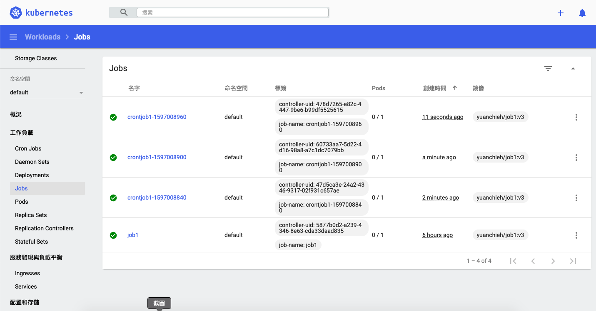
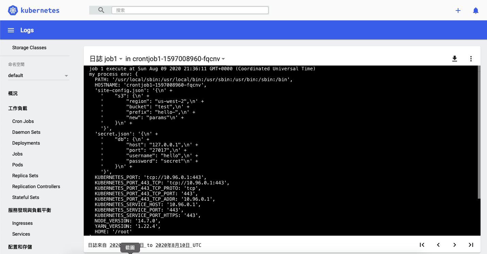
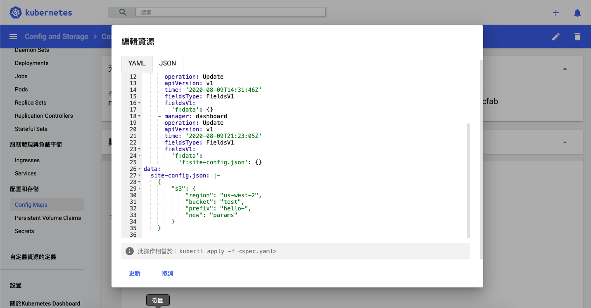
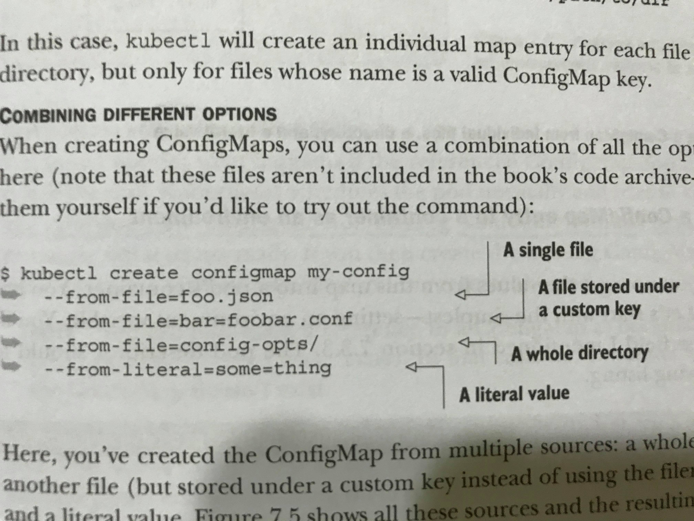
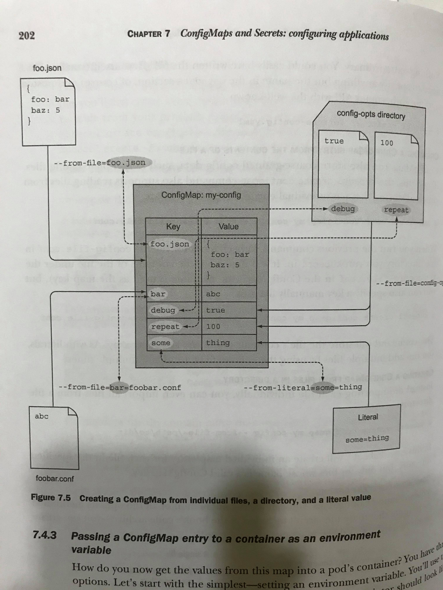

# K8S 管理 Cronjob
## 預期結果
1. 所有 cronjob 運行時間 / 結果 / log

2. log 內容

3. 瀏覽/及時修改 config
  

運行環境: Mac OS + minikube 啟動  
全部指令
```
$ kubectl create secret generic my-secret --from-file=./k8s/secret.json
$ kubectl create configmap myconfigmap --from-file=./k8s/site-config.json
$ kubectl apply -f k8s/cronJob1.yaml
$ minikube dashboard
```

## 建立設定檔
在 Kubernetes 中，如果希望指定 Container 運行時指定參數，可以依照資料的特性分成兩種型別   
`ConfigMap` 與 `Secrets`:    
1. ConfigMap 主要是放不敏感的設定檔，可以用 `kubectl create configmap {config map name} ....` 指定從檔案 / 字串等讀取設定，Value 主要是放字串為主的；    
2. Secret 則是放機敏資料，支援 binary data 或是 string data 例如 `tls 憑證` 或是`指定 private Docker hub 帳密`等，儲存上會先把值轉成 base64 儲存，並且有 1MB 的上限    

k8s 為了確保 Secret 的安全性會有幾個特性
1. 只把 Secret 傳給有宣告的 Node
2. 在這些 Node 上 Secret 僅以 in memory 方式存在而不會保留在 disk 上  
3. 在 master node 上會加密保存於 etcd 中

### 建立 Secrets
```
$ kubectl create secret generic my-secret --from-file=./k8s/secret.json

// 也可以直接在建立時指定 key value
$ kubectl create secret generic prod-db-secret --from-literal=username=produser --from-literal=password=Y4nys7f11
```
### 建立 ConfigMap
```
$ kubectl create configmap myconfigmap --from-file=./k8s/site-config.json
```

> 對照表大概長這樣 

  
注意 ConfigMap 的 key 可以是檔名的本身

## Cronjob 與讀取設定檔
先建立一個簡單的 Docker Image: `yuanchieh/job1:v3`，可以從 Dockerhub 拉下  
設定檔部分著重於設定檔的讀取 ConfigMap 和 Secret
```yaml
spec:
    containers:
    - name: job1
      image: yuanchieh/job1:v3
      command: ["node", "index.js"]
      envFrom:
        - configMapRef:
            name: myconfigmap
        - secretRef:
            name: my-secret
      volumeMounts:
        - name: db-secret
        mountPath: /etc/secret
        readOnly: true
    volumes:
    - name: db-secret
      secret:
        secretName: my-secret
```
設定檔可以用兩種方式掛載，一種是 `volume` 以檔案方式存在，另一種是 `env` 以環境變數方式存在    

### env
`envFrom` 可以指定 `configMapRef` 與 `secretRef` 對應的名稱，Container 運行時會自動讀取到環境變數 (Nodejs 透過 process.env)，至於變數名稱則依照建立的方式有所不同，如果是從檔案建立則是以 `檔名`，例如說 `site-config.json` 則是 ConfigMap 的 Key，可以看到對應的 json 檔內容變成 json stringify 後的結果   

如果擔心有多個環境變數會有衝突，可以用 `env` 並逐一指定
```
env:
- name: LANGUAGE
  valueFrom:
    configMapKeyRef:
      name: language
      key: LANGUAGE
```

> Secret 對應則是 `secret.json`，但官方不建議設定到環境變數中，此處僅供示範     

### volume  
等同於一般的 volume 宣告，只是指定型別為 secret，需注意在 mounts 時指定路徑後，實際的 secret 檔名也是依照建立方式而定，如果是從檔案建立同樣是以 `檔名`儲存，例如 `/etc/secret/secret.json` (因為當初的檔名就是 secret.json)  

> 在 job1 中的 index.js 就是直接讀取 json 檔 `const myDBConfig = require("/etc/secret/secret.json");`  
如果從環境變數還要自己 json.parse 相對比較麻煩些

k8s 預設在 mount secret volume 時是採用 tmpfs 儲存於 memory 中，相對於 Disk 或是環境變數安全性比較高

## Config 檔更新問題  
如果是執行 Cronjob，因為每一次都會執行新的 Pod 所以設定檔更新後下次就會拉到新的值  

如果是持續運行的 Pod，環境變數設定後就不會更動，所以必須砍掉 Pod 重新執行；  
如果是用 volume 則需要 reload 重新讀取檔案才可生效

## 參考資料
1. https://medium.com/google-cloud/kubernetes-configmaps-and-secrets-68d061f7ab5b